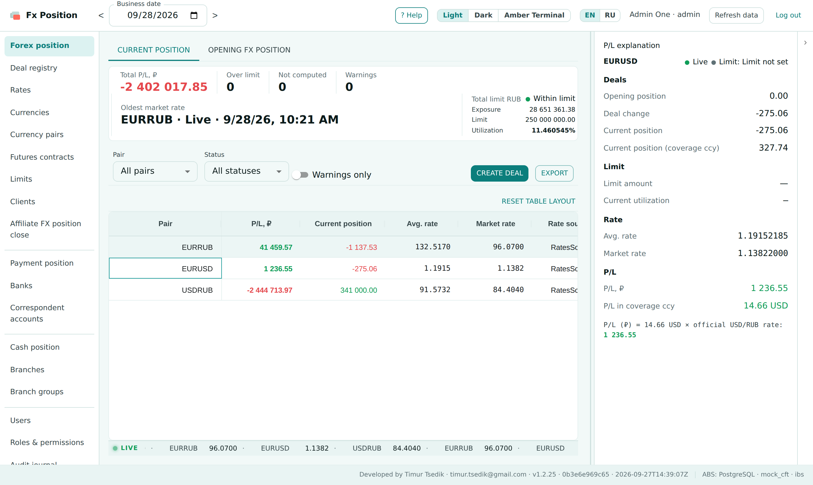
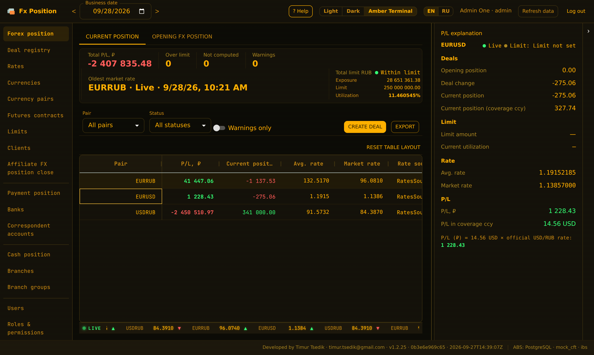

# FxPosition: case study

**Real-time FX, payment and cash position platform for a bank treasury**
Role: sole designer and developer · 2023–present · In production rollout at a top-100 Russian bank



## The problem

Every morning a bank treasury has to answer three questions: where is our FX position, will the nostro accounts cover today's payments, and how much cash sits in each branch. At most mid-size banks the answer comes from Excel built on yesterday's files, rates typed in by hand, and reconciliation against the core banking system done on paper. By noon the morning position is already out of date.

I lived with this problem for 27 years in bank treasury, 18 of them in leadership roles. In 1999 I started writing my own tool for it, and the tool followed me through three banks. In 2023 I rebuilt it from scratch as FxPosition.

## The result

- The first customer is a top-100 Russian bank
- Up to 15 users; positions in ~15 currencies
- In my own treasury, earlier versions of the tool let a desk of 2 do the work that used to take 5
- Market rates refresh every 5 seconds; core banking data is pulled every 30 seconds, so the position is at most half a minute behind reality instead of a day
- 26 releases in the first 6 weeks of rollout (1.2.0 → 1.2.25)

## Architecture

```
 Oracle core banking (read-only) ──► source adapters ──► import workers ──┐
 Market / central-bank rate feeds ──► rate adapters (priority, failover) ──┤
                                                                            ▼
                         application services (pure business rules, ports)
                                                                            │
                          PostgreSQL ◄── repositories ── projections (positions, P/L)
                                                                            │
                                           FastAPI ──► React/TypeScript UI
```

- **Ports and adapters, enforced.** 14 import-linter contracts, each with an empty allowlist, run in CI. Business rules never import SQLAlchemy. Facade layers can't touch the core-banking adapters. Swapping Oracle for another source changes one package.
- **Transaction ownership at the boundary.** Repositories never commit. The route handler or worker owns the unit of work.
- **Contract-first frontend.** TypeScript types are generated from OpenAPI, and CI fails if they drift.

## Hard problems worth talking about

**Payment matching without double counting.** Planned payments are matched against executed core-banking documents. A match can be full or partial, and the system offers several candidates without choosing for the user. The rule that matters most: the same money is never counted twice in the position. The implementation takes a row lock, checks that the source document isn't already actively matched (a duplicate returns 409), inserts the match, recomputes the row status from active matches, and writes the audit record, all in one transaction.

**Rates you can trust.** There are multiple rate sources with priority and automatic fallback when a source goes dark. "Live", "market closed" and "stale" are distinct states. If no direct quote exists, a cross rate is synthesised through a bridge currency.

**Observability judged by data, not processes.** A job counts as healthy when its data actually refreshed, not when its process is running. One request ID links the error message the user sees to the log lines, the audit record and the background run, so support can go from a user's screenshot to the root cause in one search.

**Shipping into a closed bank perimeter.** The product goes in as an offline kit: container images as tarballs, a single PDF of documentation, a software bill of materials scanned for vulnerabilities. It also includes TLS, security events forwarded to the bank's SIEM, and runbooks for install, upgrade, backup and restore.

The same screen in the Amber Terminal theme, built for dealing-room monitors:



## Stack

Python 3.12 · FastAPI · SQLAlchemy 2 · Alembic · Pydantic v2 · PostgreSQL · Oracle (oracledb) · pytest (~3,800 tests) · mypy strict · ruff · import-linter · Docker · GitHub Actions · React 19 · TypeScript · MUI · TanStack Query · AG Grid

## Links

Product site: [fxposition.ru/en](https://fxposition.ru/en) · Live demo: [fxposition.biz](https://fxposition.biz), access on request · Source is closed (commercial product)
