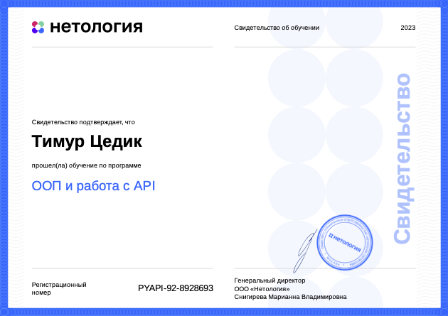
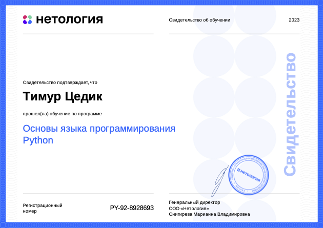

<image src="me.jpg" width="300">

<h1>Hi, I'm Timur Tsedik and I'm a developer</h1>

<h2>Telegram - https://t.me/TinTinSmith
  
Mail - timur.tsedik@gmail.com

Key skills: Python, SQL (MSSQL, ORACLE, Postgres), VB6, VBA</h2>

<h2>Expirenced on integrating into banking ABS</h2>
  
<h3>My works:</h3> 
Created an app to controll FX and payment position for the commercial bank, fully integrated with automated bank system  

those projects on Python: 

Avito website parsing bot on Selenium engine, containerised solution
with storing results in DB and API for communicating https://github.com/TimurTsedik/avito_parsing_bot

Documetn searching bot by ElasticEngine
Containerised solution https://github.com/TimurTsedik/documentsSearchEngine_by_ElasticSearch

findning couple via VK API, VK bot for dating
https://github.com/TimurTsedik/VKinder

telegram bot for learning English
https://github.com/TimurTsedik/telegram_english_bot

backup photos from VK profile onto Yandex disk
https://github.com/TimurTsedik/netology_api_VK_YA_exercise

Sertificates:

